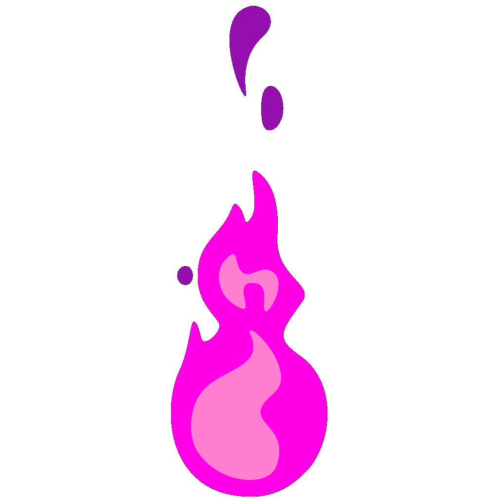
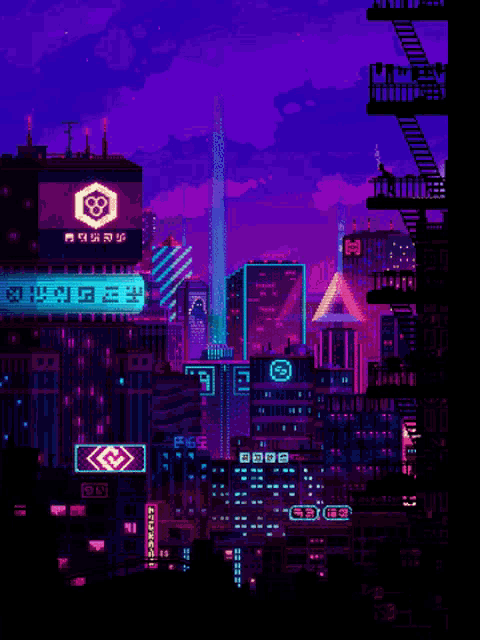
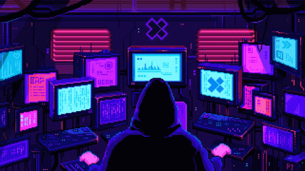
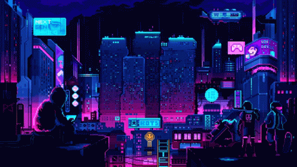
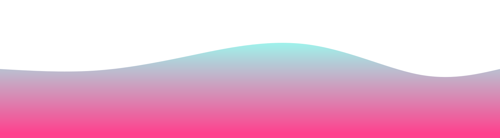

  
  
  

 
  
<b>Profile Views</b>

  

<h2></h2>

<h2 align="center"> Self-taught and passionate about coding! </h2> 

* 👨‍💻 I'm Jarrian(godkingjay)👋, a college student, I'm currently pursuing a Computer Science Degree in the Philippines.    

* 🌳 I’m currently learning TypeScript, React and NextJS!    

* 🐾 I’m looking to network and make friends here!    

* 🌊 2023 Goals: Learn AI and Machine Learning and Contribute to Open Source Projects.    

* ☕ Interest: Science, Math, Coffee, and Coding.    

*  Hobbies: Sleeping, Reading, Anime, Manga, Web Novel, and Facebook.   

<h2></h2>

  <h2> <strong> 📚 Education </strong>  </h2> 
  
  
  
  
  
  
  

 

<h2></h2>

   

  
  
  
  <h2> <strong> ⚙️ Technologies and Skills </strong></h2> 
  
    
  <h2></h2>
  <h3> <strong> Languages, Frameworks, and Tools </strong></h3>
    
  <h2></h2>
  <h3> <strong> Actively Learning </strong></h3>
     
  <h2></h2>
  <h3> <strong> Planning to Learn </strong></h3>
  

<h2></h2>

<!-- 

<h2 align="center">💻 Workspace</h2>

| 👩‍💻 Device |  ⚙️ Specification | 📃 Purpose |
|:------:|:-------------:|:---------:|
|  |      |    |

<h2></h2>

   

 -->

  <h2> 🏆 My Github Stats </h2> 
    <h2></h2> 
  
  

  

  

 

<h2></h2>

  <h2 align="center">👨‍💻 Projects </h2> 
  
  

<!--  -->

